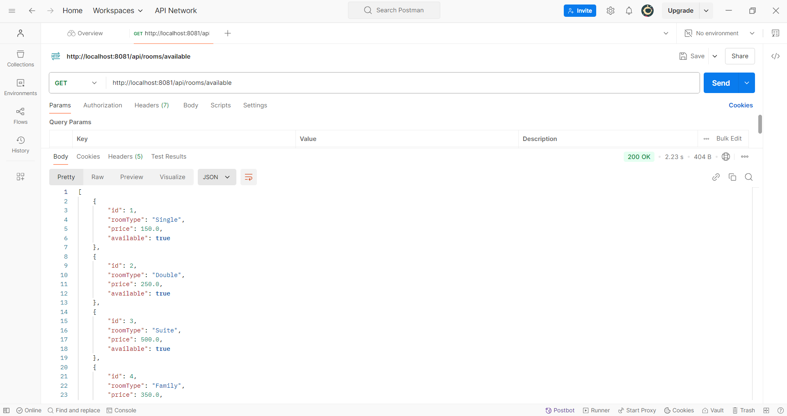
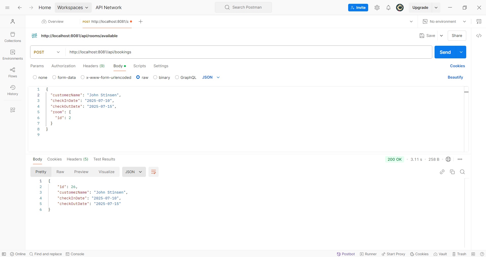
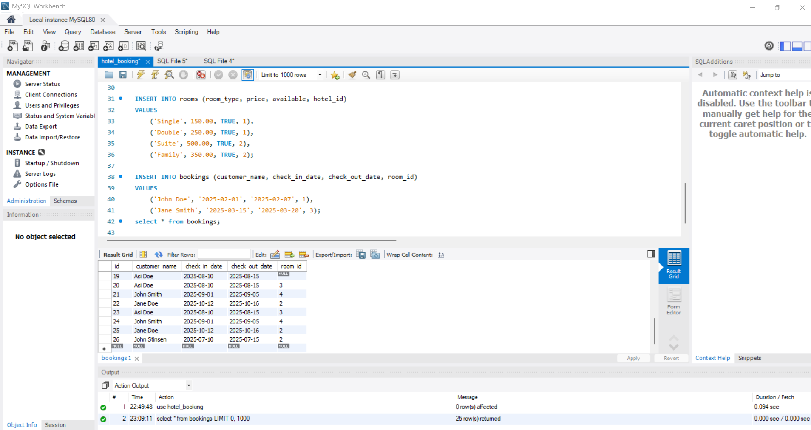
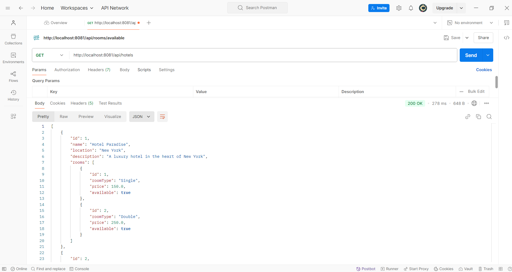

# 🏨 Hotel Booking System
A full-stack hotel booking management web application built using Spring Boot, MySQL, and JSP/Servlets. This project allows users to manage hotel bookings, view available rooms, and perform CRUD operations on guests and bookings.

# 🚀 Features

🔐 User login and registration

🏨 Book, view, update, or cancel hotel rooms

📋 Admin panel to manage bookings and guests

📊 Real-time room availability tracking

✅ JSP-based frontend with Bootstrap styling

🗃️ Data stored in MySQL

# 🛠️ Tech Stack

Layer	Technology

Backend:	Java + Spring Boot

Frontend:	JSP, HTML, CSS

Database:	MySQL

Build Tool:	Maven

## 📸 Screenshots

### 🛏️ Available Rooms Page

### 📅 Booking Page

### 🗄️ MySQL Database Structure

### 🏨 Hotels Listing Page

